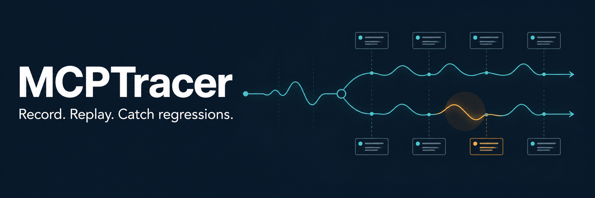
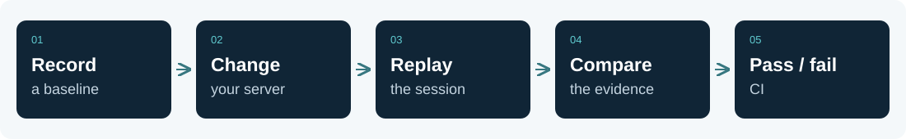

<p align="center">
  
</p>

# MCPTracer

**Wireshark for MCP—with replay and regression tests.**

Record, inspect, replay, compare, and test the interactions between AI agents
and MCP servers. See which tools were called, what arguments they received,
what they returned, how long calls took, and where they failed.

Then go beyond inspection: compare runs, catch tool-contract drift, make
regressions fail CI, and keep the recorded evidence locally.

[Quick start](#quick-start) · [Try the demo](#see-it-catch-a-regression) ·
[Who it's for](#who-is-this-for) · [Command guide](docs/usage.md) ·
[Contribute](CONTRIBUTING.md) · [About](ABOUT.md)

> **Noncommercial source preview · pre-1.0.** Commercial use requires written
> permission from ard12. See [licensing](COMMERCIAL-LICENSE.md). Published binary releases,
> package-manager installs, and a released GitHub Action are not yet advertised.

## Who is this for?

| You are… | You want to know… |
| --- | --- |
| An MCP server author | Did this update break calls or change the tool contract? |
| A developer integrating agents with MCP tools | What did the agent send, and why did the server fail? |
| A maintainer adding CI checks | Can this change pass the same recorded workflow and assertions? |
| A security reviewer investigating MCP behavior | Which tool definitions or exchanges changed, and what evidence supports that? |

Use it when you can wrap the MCP server command or point the client at the
HTTP proxy. The Wireshark comparison is about inspecting communication:
MCPTracer records structured MCP messages routed through it. Ordinary editor,
terminal, or AI coding activity outside that MCP traffic is outside its view.

## Why use it?

| When you need to… | MCPTracer helps you… |
| --- | --- |
| Check an MCP server update | Replay a recorded session and compare the result. |
| Catch a changed tool contract | Detect changed descriptions, schemas, and added or removed tools. |
| Turn a regression into a CI failure | Assert no errors, pin tool definitions, or compare a golden session. |
| Develop against recorded responses | Serve a captured session as an offline mock. |
| Investigate a failure | Inspect local history and export guarded, portable evidence. |

## How it works



The stdio proxy forwards original bytes while recording a normalized copy.
Streamable HTTP recording uses a local reverse proxy. Sessions live in a local
SQLite database; replay runs against a live target, while offline `serve` uses
stored responses without contacting that target.

## Quick start

Requires **Rust 1.85+** and a C toolchain for bundled SQLite. On Windows,
install the MSVC Build Tools and Windows SDK. The demo also needs Python 3.10+
and Bash (Git Bash works on Windows).

```bash
git clone https://github.com/ard12/mcptracer.git
cd mcptracer
cargo install --path crates/mcptracer-proxy --locked
mcptracer --version
```

Already have a checkout? Run the last two commands from its root.
For exact-revision installation and verification, see [Installation](docs-site/src/installation.md).

### See it catch a regression

```bash
cd examples/rug-pull-demo
bash run.sh
```

The demo records a trusted tool, then changes only its declared description.
The responses stay the same. MCPTracer reports the tool-contract change and
fails the pinning check. The demo script itself succeeds when both detectors
catch the change. It uses a local fake server; no model account or API key is needed.

Read the [walkthrough](examples/rug-pull-demo/README.md) for the commands and evidence.

### Use it with your server

Wrap the server command in your MCP client's configuration:

```bash
mcptracer record --redact default -- your-mcp-server
```

Then exercise the server through that client. Running the wrapper alone does
not generate client requests. Use `mcptracer sessions list` to find the recording.

The following is a template: replace the session IDs and server command.

```bash
mcptracer replay <baseline-id> --redact default -- your-mcp-server
mcptracer diff <baseline-id> <replay-id>
mcptracer assert <replay-id> --golden <baseline-id>
```

`diff` exits 1 on a meaningful change. `assert` exits nonzero when its checks fail.
Replay executes real tool calls; use a test target. Redacted recordings replay
stored placeholders, so they may not reproduce calls that require real secrets.

## Explore

| Guide | What you will find |
| --- | --- |
| [Onboarding: your first recording](docs/onboarding.md) | A first-run journey: install, wrap a client, make a tool call, and compare two sessions in about ten minutes. |
| [Command guide](docs/usage.md) | Recording, client setup, replay, offline mocks, diffing, and exports. |
| [Capability reference](docs-site/src/reference/capabilities.md) | A short explanation of every command. |
| [CI integration](docs/ci.md) | Turn local evidence into automated checks. |
| [Architecture](docs/architecture/overview.md) | Data flow and crate ownership. |
| [Compatibility](docs/spec/mcp-2026-07-28.md) | Supported behavior and protocol gaps. |
| [Security](SECURITY.md) | Recording risks, redaction limits, and private reporting. |

## Know the boundaries

- Recordings can contain credentials, file contents, and customer data. Redaction
  is opt-in for capture and best effort. Stored databases are unencrypted;
  review evidence before sharing it. See the [security policy](SECURITY.md).
- MCP compatibility is partial, including newer stateless recording and HTTP
  replay workflows. This preview does not claim full current-spec conformance.
- Derived analysis commands are advisory. The core workflow is capture,
  validate, replay, compare, and gate.
- CI is configured for Windows, Linux, and macOS. Check the workflow results for
  the exact commit you use; configured jobs are not proof of a passing run.

## Contribute

Reproductions, clearer docs, small fixes, and compatibility test cases are welcome.
Start with [CONTRIBUTING.md](CONTRIBUTING.md) for setup, crate ownership,
checks, and how public patches reach a generated release.

For vulnerabilities, use the private route in [SECURITY.md](SECURITY.md).

## About and contact

Maintained by [ard12](https://github.com/ard12).
See [About MCPTracer](ABOUT.md) for the project and maintainer section.

| Contact | Details |
| --- | --- |
| Commercial licensing | [Request permission](https://github.com/ard12/mcptracer/issues/new?template=licensing_request.md) |
| Email | [ard45067@gmail.com](mailto:ard45067@gmail.com) |

## License and credit

MCPTracer uses the custom [Noncommercial Attribution License](LICENSE).
Noncommercial use is permitted under its terms. **Commercial use requires
prior written permission from ard12**, including internal business use and CI.
This is source-available software, not an open-source license.

Preserve [NOTICE](NOTICE) and credit MCPTracer by ard12 and contributors in the
documentation or About/credits page of public projects that incorporate or
materially rely on it. See [commercial permission and attribution](COMMERCIAL-LICENSE.md)
for the scope, credit wording, and permission process.
